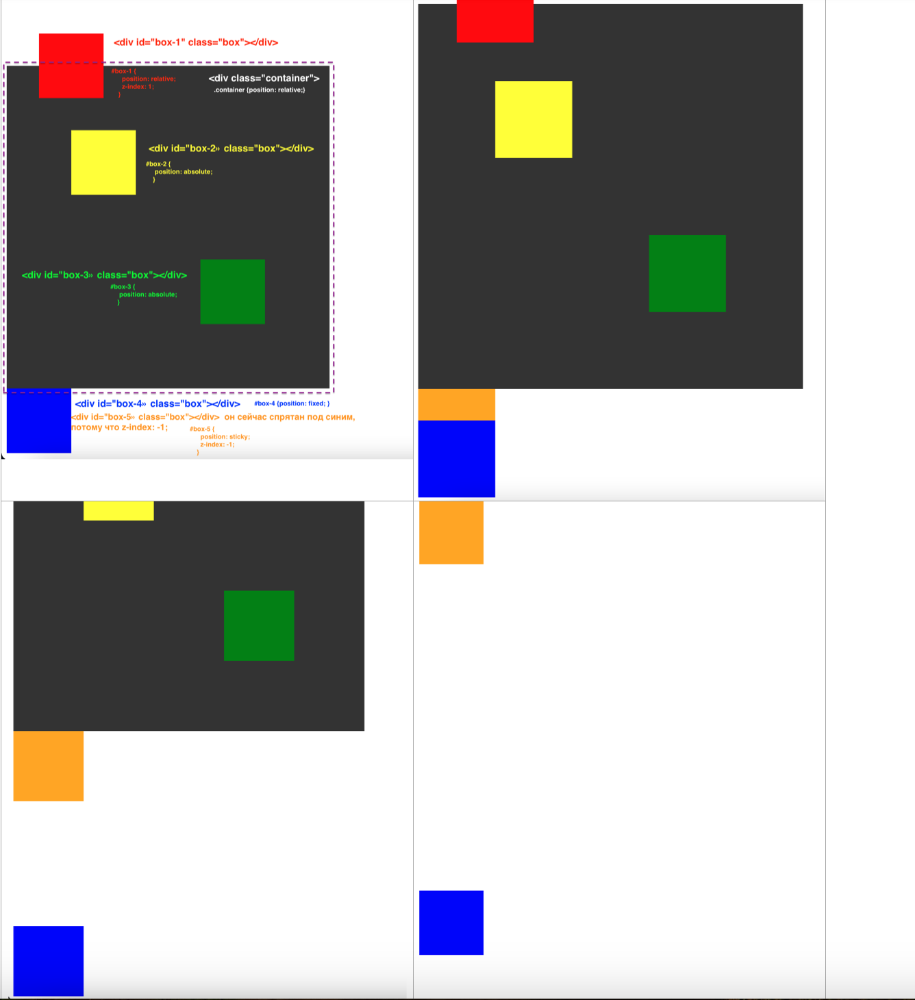

## Position

- По умолчанию всех position: static 

- Если укажем top/left при position: static => ничего не выйдет!
- Если укажем top/left при position: relative => смещениние на указанные величины относительно того места где стоял бы по умолчанию

- position: absolute => смещение относительно родителя, у которого position: relative (если родителя нет => body)

- position: fixed => при прокручивании останется на месте. Элемент как бы вырезается из контекста, все, что было ниже поднимается, а сам элемент зафиксирован на месте как фон

- position: sticky =>  можно зафиксировать в определенном месте. Часто используется для иконки меню.

- z-index => чем выше z-index, тем ближе элемент к нам

- body {height: 4000px; } добавили странице такую высоту, чтобы можно было ее прикручивать 

- При прокручивании синий квадрат закреплен на месте, как бы вырывается из контекста(fixed)

- При прокручивании вниз, когда оранжевый квадрат достигнет самого верха, там он и останется(sticky)
